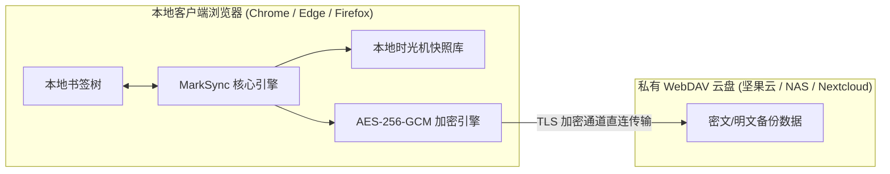

<p align="center">
  
</p>

<h1 align="center">汇签 MarkSync</h1>

<p align="center">
  <strong>现代化、隐私优先的跨浏览器 WebDAV 书签双向同步扩展</strong>
</p>

<p align="center">
  <a href="https://github.com/1378944437/marksync/releases/latest">
    
  </a>
  <a href="https://github.com/1378944437/marksync/releases">
    
  </a>
  <a href="./LICENSE">
    
  </a>
  
  
  
</p>

<p align="center">
  <a href="./README.md"><strong>简体中文</strong></a> | <a href="./README_en.md">English</a>
</p>

---

## 📖 简介

**汇签 (MarkSync)** 是一款面向现代多浏览器生态打造的跨平台书签双向同步浏览器扩展。它彻底摒弃了中心化第三方中转服务器，将完全的数据主权交还给用户。通过标准的私有 WebDAV 协议，在 Chrome、Edge、Firefox 等主流浏览器及多台设备之间实现书签的毫秒级增量同步与端到端高强度加密保护。

无论您使用的是 **坚果云 (Nutstore)**、**Nextcloud / ownCloud**、**群晖 Synology NAS**、**InfiniCLOUD** 还是自建的 **Alist / Apache / Nginx WebDAV**，MarkSync 均能开箱即用。

---

## 📸 界面预览

| 深色模式 (Dark Mode) | 浅色模式 (Light Mode) |
| :------------------: | :-------------------: |
|  |  |

---

## ✨ 核心特性

- 🛡️ **端到端隐私安全 (E2E AES-256-GCM)**
  - 基于 PBKDF2 强密钥派生与带认证的 AES-256-GCM 对称加密；
  - 本地草稿隔离与显式保存契约，实时密码强度可视化（弱/中/强）与防误触确认；
  - 书签数据离开本地浏览器前已全量加密，即使云盘服务商也完全无法嗅探书签内容与目录层级。
- 🔄 **智能增量双向同步与三路合并**
  - 基于树形 SHA-256 结构哈希对比算法，毫秒级精准探测本地与云端的变更差异；
  - 仅传输增量变更，节省网络带宽；
  - 具备同名目录智能归一化与防碰撞合并机制，杜绝多端同步导致的书签翻倍膨胀。
- 🧩 **开箱即用服务商预设**
  - 内置坚果云、Nextcloud、群晖 NAS、InfiniCLOUD 等主流云盘一键配置模板；
  - 自动填充服务商规范的 WebDAV 路径与建议文件名，告别手动拼接 URL 的困扰。
- 📦 **本地时光机快照与一键回滚**
  - 任何云端操作执行前自动捕获本地书签全量快照；
  - 支持快照历史配额管理与一键还原，彻底消除断网、冲突或误删造成的数据丢失风险。
- 📱 **多端响应式与移动端友好**
  - 标准 `380px × 560px` 紧凑桌面视口；针对移动端（Firefox Android、Kiwi 浏览器等）360px/375px 视口提供流式自适应优化，防边缘截断与内容贴边；
  - 密码一键显隐与失焦（onBlur）持久化，配合防抖上传与滚动手势隔离。
- 🎨 **现代化分组架构与设计系统**
  - 四大清晰业务领域：常规设置、服务商连接、安全加密、备份与维护；
  - 浅色/深色自适应外观、无闪烁全局 ThemeProvider、微交互动效与双勾（CheckCheck）一致性微徽章。
- 🌐 **全主流浏览器兼容**
  - 严格遵循 W3C WebExtensions API 标准与 Manifest V3；
  - 支持 Chrome、Microsoft Edge、Brave、Vivaldi、360 极速浏览器以及 Firefox 140+。

---

## 📦 安装指南

最新版本安装制品可直接前往 [GitHub Releases 页面](https://github.com/1378944437/marksync/releases/latest) 下载。

### Chrome / Microsoft Edge / Brave / Chromium 内核浏览器

> 💡 **固定扩展 ID 说明**：本扩展在打包时配置了固定公钥签名，在离线安装后生成的扩展 ID 固定为 `fpccfkjndkjiljfj`。后续更新版本时只需直接覆盖本地解压目录即可完成升级，配置项与本地数据均会完整保留！

1. 在 [Releases 页面](https://github.com/1378944437/marksync/releases/latest) 下载 `marksync-chrome-vX.X.X.zip`（或 `chrome-extension.zip`）；
2. 将下载的 ZIP 压缩包解压到本地固定文件夹（例如：`D:\extensions\marksync`）；
3. 打开浏览器并访问对应扩展管理页面：
   - Google Chrome / Brave: `chrome://extensions/`
   - Microsoft Edge: `edge://extensions/`
4. 打开页面右上角的 **「开发者模式」 (Developer Mode)**；
5. 点击左上角的 **「加载已解压的扩展程序」 (Load unpacked)**；
6. 选中刚才解压出来的文件夹，安装即刻完成！

**后续版本无缝升级步骤：**
- 下载最新版本 ZIP 包，解压并**直接覆盖**原本地文件夹内的全部文件；
- 返回浏览器的扩展管理页，点击 MarkSync 卡片上的 **「刷新」** 按钮即可平滑完成升级。

---

### Firefox 火狐浏览器

> **环境要求**：Firefox 140 或更高版本。

1. 在 [Releases 页面](https://github.com/1378944437/marksync/releases/latest) 下载经 Mozilla 官方签名的附加组件安装包 `marksync-firefox-vX.X.X.xpi`；
2. **拖拽即装**：直接将下载的 `.xpi` 文件用鼠标拖入 Firefox 浏览器窗口中，在弹出的安全权限提示中点击 **「添加」** 即可；
3. **附加组件管理器安装**：在 Firefox 地址栏输入 `about:addons`，点击右上角齿轮图标 ⚙️，选择 **「从文件安装附加组件...」** 并选中该 `.xpi` 文件完成安装。

---

## ⚙️ 快速上手与配置指南

1. **唤起面板**：点击浏览器右上角工具栏中的 MarkSync 汇签图标；
2. **配置 WebDAV**：点击右上角齿轮图标进入「设置」→「服务商与连接」；
3. **选用服务商预设**（或手动输入）：
   - 在预设下拉菜单中选择您的服务商（例如「坚果云」或「Nextcloud」），系统会自动为您补全标准 WebDAV 终端 URL；
   - 输入您的账户用户名与应用专用授权密码；
4. **测试连接**：点击 **「测试连接」** 按钮，验证网络连通性与账号凭据有效性；
5. **开启端到端加密（强烈推荐）**：
   - 进入「设置」→「安全与加密」；
   - 输入您自定义的主密码（至少 8 位），观察密码强度指示条，输入确认密码后点击 **「启用并保存加密」**；
   - 系统将立即在本地完成密钥派生并使用 AES-256-GCM 对云端备份进行重新加密；
   - ⚠️ **请务必牢记主密码**：多台设备之间同步时必须输入完全相同的主密码；
6. **启动双向同步**：返回扩展主页，点击 **「立即同步」** 按钮。同步完成后首页卡片将点亮双勾状态微徽章。

---

## 🏢 主流 WebDAV 服务商配置速查表

| 服务商 | 推荐 WebDAV 服务器 URL 格式 | 账号 / 用户名 | 密码类型 / 注意事项 |
| :--- | :--- | :--- | :--- |
| **坚果云 (Nutstore)** | `https://dav.jianguoyun.com/dav/` | 注册邮箱 | ⚠️ **必须使用应用授权密码**（在坚果云网页版「账户信息」→「安全设置」→「第三方应用管理」中生成），切勿填写账户登录密码 |
| **Nextcloud** | `https://your-cloud.com/remote.php/dav/files/USER/` | 登录用户名 | 推荐在「个人设置」→「安全」中生成设备专用密码；URL 末尾必须包含斜杠 `/` |
| **群晖 NAS (Synology)** | `https://nas.example.com:5006/home/` | DSM 账号 | 需在 DSM 套件中心安装 WebDAV Server 并开放 HTTPS 端口（默认 5006） |
| **InfiniCLOUD** | `https://my.infinicloud.com/dav/` | Connection ID | 登录 InfiniCLOUD 个人仪表盘开启 WebDAV Connection 并生成专用连接密码 |
| **自建 WebDAV / Alist** | `https://dav.example.com/dav/` | 自建账号 | 确保服务器支持标准的 `PROPFIND`、`GET`、`PUT`、`MKCOL` 等 HTTP 动词 |

---

## 🛡️ 数据隐私与安全设计模型



1. **绝对零中转服务器**：MarkSync 绝不架设任何中转服务器，不收集任何用户隐私数据或使用遥测；
2. **凭据安全沙箱隔离**：您的 WebDAV 账号、密码以及主加密密钥仅保存在本地受浏览器沙箱保护的私有存储空间中（`browser.storage.local`）；
3. **操作可逆与时光机保障**：任何云端覆盖或恢复操作前均自动生成本地版本快照，无论遇到断网、冲突还是误操作，随时支持无损回滚。

---

## 🏗️ 架构设计与分层规范

MarkSync 严格遵循 **领域驱动设计 (DDD)** 原则：

```
packages/app/src/
├── core/                # 领域核心层：实体定义、增量合并、哈希计算、加解密、快照管理器
├── infrastructure/      # 基础设施层：WebDAV 客户端封装、本地存储适配器、浏览器书签 API 适配器
├── application/         # 应用服务层：同步编排、事件调度、自动化同步轮询
└── components/          # 表现展示层：现代 React 19 组件、设置抽屉、状态卡片、原子 UI
```

- **单文件规范**：严格恪守单一职责原则，每个源代码文件控制在 300 行以内；
- **平台解耦**：浏览器差异性 API 统一封装在基础设施层，核心领域逻辑拥有 100% 独立单测能力；
- **完备单测保障**：包含 31 个测试套件，346+ 个自动化单元测试用例，全方位覆盖去重算法、合并策略与恢复回滚等边界场景。

---

## 🛠️ 本地开发与构建指南

### 环境依赖
- Node.js >= 20.0.0
- pnpm >= 10.0.0

### 常用命令

```bash
# 1. 克隆代码仓库
git clone https://github.com/1378944437/marksync.git
cd marksync

# 2. 安装项目依赖
pnpm install

# 3. 运行自动化单元测试套件
pnpm test

# 4. 启动 Chrome 扩展开发模式（热重载）
pnpm dev:chrome

# 5. 启动 Firefox 扩展开发模式
pnpm dev:firefox

# 6. 全量生产构建（执行 strict 类型检查）
pnpm build

# 7. 打包分发扩展包
pnpm package
```

---

## ❓ 常见问题排查 (FAQ)

<details>
<summary><strong>Q1: 坚果云测试连接提示「401 Unauthorized」？</strong></summary>

> 坚果云禁止直接使用账户登录密码访问 WebDAV。请登录坚果云网页版，进入「账户信息」→「安全设置」→「第三方应用管理」，点击「添加应用密码」生成专用授权密码并在 MarkSync 中填入。
</details>

<details>
<summary><strong>Q2: Nextcloud 提示「405 Method Not Allowed」？</strong></summary>

> 请检查 WebDAV 服务器地址是否输入完整。标准 Nextcloud WebDAV 路径格式为：`https://domain.com/remote.php/dav/files/用户名/`，末尾必须带有斜杠 `/`。
</details>

<details>
<summary><strong>Q3: 多个浏览器同步后书签是否会发生重复？</strong></summary>

> 不会。MarkSync 拥有成熟的 URL 指纹比对算法与同名目录合并策略。在同步合并过程中，相同层级下的同 URL 书签会自动归一化去重。如果不小心误操作，可随时通过「备份与维护」中的历史快照恢复至初始状态。
</details>

<details>
<summary><strong>Q4: 开启端到端加密后忘记主密码怎么办？</strong></summary>

> 因安全模型基于 AES-256-GCM 强加密算法，**无任何后门或密码恢复机制**。若遗失密码，您需要在新设备上重置密码并从本地书签重新推送到云端覆盖。强烈建议将主密码妥善保存至您的密码管理器中。
</details>

---

## 📄 开源许可证

本项目基于 [GNU Affero General Public License v3.0 (AGPL-3.0)](./LICENSE) 协议开源。
