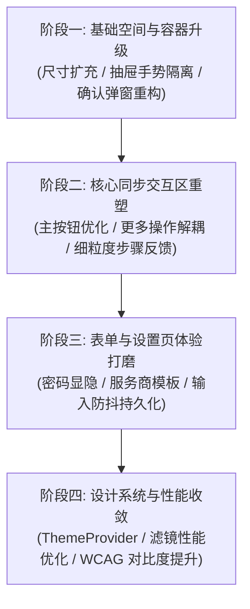

# marksync UI / UX 专项审查报告与重塑计划

- **项目名称**：marksync (书签同步浏览器扩展)
- **审查范围**：`packages/app/src/components`、`styles/`、交互链路与设计系统
- **审查性质**：只读交互/视觉/组件设计深度评估与演进建议
- **交付目标**：明确当前 UI/UX 核心缺陷并给出分阶段落地的实施重塑计划

---

## 目录
1. [UI 总体评估与体验现状](#一ui-总体评估与体验现状)
2. [关键 UI/UX 缺陷与体验痛点分析](#二关键-uiux-缺陷与体验痛点分析)
3. [组件架构与状态反馈审查](#三组件架构与状态反馈审查)
4. [视觉与设计系统规范审查](#四视觉与设计系统规范审查)
5. [系统化 UI 演进计划表 (分阶段 Roadmap)](#五系统化-ui-演进计划表-分阶段-roadmap)
6. [标准交付交接说明](#六标准交付交接说明)

---

## 一、UI 总体评估与体验现状

marksync 采用了现代前端技术栈（React 19 + Tailwind CSS + Framer Motion + Lucide 图标 + Sonner Toast），界面整体具备清爽的现代感与毛玻璃微质感。特别是拆分出 `ConfirmDrawers`、`SyncDrawerPanels` 及 `settings/` 各子页面后，组件代码结构已显著改善。

### 核心体验维度评分 (满分 10 分)

| 评估维度 | 得分 | 核心现状评价 |
| :--- | :---: | :--- |
| **视觉风格与现代感** | 8.5 / 10 | 渐变弥散光、圆角、Tailwind 变量、毛玻璃效果搭配协调，具备现代质感。 |
| **交互动画与过渡** | 8.0 / 10 | 选项卡切换、设置子页面左右滑动切换、抽屉展开动画流畅自然。 |
| **空间利用与信息密度** | 6.0 / 10 | 固定 360px 较拥挤，巨型圆形按钮占用过多垂直空间，信息展示局促。 |
| **状态反馈与过程感知** | 5.5 / 10 | 同步过程仅有单一旋转圈，缺少阶段感知（查询/下载/解密/合并/写入）。 |
| **复杂交互与手势体验** | 6.0 / 10 | 抽屉手势拖拽易与列表滚动冲突；抽屉内部再叠第二层确认抽屉不够符合直觉。 |
| **表单与设置易用性** | 6.5 / 10 | WebDAV 密码缺少显隐眼睛图标；按键即写 storage 缺少输入防抖；缺少连接诊断指引。 |

---

## 二、关键 UI/UX 缺陷与体验痛点分析

### 1. 面板尺寸写死 `360px`，空间局促且多语言适配不佳 (严重性: 高)
- **代码定位**：[`LayoutWrapper.tsx:L4`](file:///c:/Users/z1768/Desktop/bookmark-syncer-master/packages/app/src/components/LayoutWrapper.tsx#L4)
  ```tsx
  className="relative w-[360px] h-[520px] bg-background text-foreground ..."
  ```
- **体验痛点**：
  - `360px` 属于较早期扩展的标准宽度。在当前主流 2K/4K 屏幕及现代浏览器中显得非常窄；
  - 英文环境（`en`）下的文本长度通常比中文长 1.5 ~ 2 倍。例如云端时间 + 浏览器 + 设备备注（`2026/9/13 16:30:25 (Chrome) · Macbook-Pro`）在 360px 宽度下会产生难看的换行与局部截断；
  - `h-[520px]` 固定高度导致抽屉展开时，中间列表的可视滚动高度不足 200px，浏览快照历史和云端备份时需要频繁局促滚动。
- **改进建议**：
  - 将弹窗基准宽度扩大至 **`380px ~ 400px`**，高度调整至 **`560px ~ 580px`**，在不显得笨重的前提下大幅提升多语言文字舒适度与列表阅读区。

---

### 2. 居中巨型圆钮占用面积过大，且伴随误触风险 (严重性: 中高)
- **代码定位**：[`SyncView.tsx:L156-L195`](file:///c:/Users/z1768/Desktop/bookmark-syncer-master/packages/app/src/components/SyncView.tsx#L156-L195)
- **体验痛点**：
  - 主同步按钮是一个 `w-40 h-40`（160px 直径）的居中大球，占据了中间 50% 以上的可视高度；
  - “更多操作”按钮（`w-12 h-12`）紧紧悬浮贴合在主按钮的右下角：
    - 两个圆形重叠摆放，鼠标快速滑过或触摸板点击时，极易因小圆偏小而**误点击到旁边的大球**，直接触发了全量同步，而非打开更多菜单；
    - 视觉重心失衡，大圆中仅放置了一个图标与文字，信息呈现密度过低。
- **改进建议**：
  - 将“更多选项”移至卡片或顶部工具栏（如右上角图标），解除与同步大按钮的物理重叠；
  - 将单一圆形按钮优化为**带有状态环（Progress Ring）的双态操作卡片或流线型核心按钮**，提供更清晰的点击区域判定。

---

### 3. 抽屉手势滑动与内部滚动条产生严重手势冲突 (严重性: 高)
- **代码定位**：[`Drawer.tsx:L45-L75`](file:///c:/Users/z1768/Desktop/bookmark-syncer-master/packages/app/src/components/Drawer.tsx#L45-L75)
- **体验痛点**：
  - `Drawer` 设置了 Framer Motion 全局纵向拖拽 `drag="y"`，并在 `handleDragEnd` 中判断：
    ```ts
    if (info.offset.y > 100 || info.velocity.y > 500) onClose();
    ```
  - 但抽屉内容区同时设置了 `overflow-y-auto`（快照和备份列表）；
  - 当列表有十几个备份时，用户在滚动区上方向下快速滑动滚动条想要浏览顶端内容时，**经常会直接触发抽屉的整体下拉关闭事件**，造成极差的被打断感。
- **改进建议**：
  - 将 `drag="y"` 约束仅绑定在顶部的拖拽条区域（`Handle Bar`），内容可滚动区域严禁捕获关闭拖拽手势；
  - 或者支持“仅当内容列表 `scrollTop === 0` 时向下拖拽才响应关闭”。

---

### 4. “抽屉套抽屉”的二次确认层级混淆 (严重性: 中)
- **代码定位**：[`ConfirmDrawers.tsx:L34`](file:///c:/Users/z1768/Desktop/bookmark-syncer-master/packages/app/src/components/sync/ConfirmDrawers.tsx#L34) 与 [`ConfirmDrawers.tsx:L84`](file:///c:/Users/z1768/Desktop/bookmark-syncer-master/packages/app/src/components/sync/ConfirmDrawers.tsx#L84)
- **体验痛点**：
  - 用户从底部拉出一个“更多操作”抽屉，在里面点击“强制覆盖云端”，系统又从底部拉出第二个抽屉 `OverwriteConfirmDrawer`；
  - 从快照列表点击“恢复快照”，又拉出 `RestoreConfirmDrawer`；
  - 两个抽屉背景遮罩叠加（黑色半透明层越来越暗），关闭时层级退栈逻辑会让用户对当前视图深度产生迷失感。
- **改进建议**：
  - 抽屉用于展示“长列表/复杂配置”（如快照列表、云端备份列表）；
  - **二次确认一律使用居中轻量对话框（Centered Alert Dialog / Modal）**，高对比度呈现警示信息，视觉层级分明且符合桌面级应用规范。

---

### 5. 同步过程缺乏分段进度与清晰的状态感知 (严重性: 中)
- **代码定位**：[`SyncView.tsx:L167-L178`](file:///c:/Users/z1768/Desktop/bookmark-syncer-master/packages/app/src/components/SyncView.tsx#L167-L178)
- **体验痛点**：
  - 触发同步后，状态只有 `checking` ➔ `syncing` 两个文字，搭配同一个旋转图标；
  - 针对大型书签库（数千个书签 + 慢速 WebDAV 网络），耗时可能需要 5 ~ 10 秒；
  - 用户无法获知当前进行到哪一步：是网络下载慢？是在解密？还是在向浏览器写入书签？容易让用户误以为扩展卡死而强行关闭弹窗。
- **改进建议**：
  - 细化状态机粒度，在状态提示区平滑切换更明确的微文案：
    `连接云端...` ➔ `解密并解析备份...` ➔ `比对本地书签...` ➔ `正在智能合并...` ➔ `同步完成`。

---

### 6. 底栏无意义的写死占位小圆点 (严重性: 低)
- **代码定位**：[`SyncView.tsx:L224-L228`](file:///c:/Users/z1768/Desktop/bookmark-syncer-master/packages/app/src/components/SyncView.tsx#L224-L228)
  ```tsx
  <div className="flex -space-x-2">
    {/* Avatars or logic dots */}
    <div className="w-2 h-2 rounded-full bg-indigo-500" />
    <div className="w-2 h-2 rounded-full bg-emerald-500" />
  </div>
  ```
- **体验痛点**：
  - 底栏查看快照入口右侧写死了两个重叠的彩色点（一紫一绿）。用户第一反应通常会以为这是“网络状态指示”或“设备连接状态”，但实际上没有任何逻辑绑定，只是写死的纯装饰代码，产生视觉干扰。
- **改进建议**：
  - 替换为真实有意义的数据：例如显示本地快照数量徽标（Badge，如 `3 份快照`）或标准的进入箭头 `ChevronRight`。

---

### 7. 表单细节体验缺陷 (严重性: 中)
- **代码定位**：[`WebDAVPage.tsx:L124-L128`](file:///c:/Users/z1768/Desktop/bookmark-syncer-master/packages/app/src/components/settings/WebDAVPage.tsx#L124-L128)
- **体验痛点**：
  - **密码明文显隐开关缺失**：端到端加密设置里贴心提供了 `Eye / EyeOff` 切换，但用户最常配置且最容易输错的长密码——WebDAV 授权密码框却只有纯 `type="password"`，无法核对自己是否输错；
  - **按键实时写盘**：用户输入 URL 和密码时，每次击键立即触发 `browser.storage.local.set`，不仅消耗扩展存储 I/O，还可能在用户输入半截 URL 时触发后台监听器的异常响应；
  - **缺少常见 WebDAV 服务快速配置模板**：坚果云（Jianguoyun）、Nextcloud、InfiniCLOUD 等服务商的 WebDAV URL 路径规则各不相同，纯空白输入框使得小白用户极易配错。
- **改进建议**：
  - 为 WebDAV 密码输入框增加 `Eye / EyeOff` 显隐按钮；
  - 改用受控表单，仅在点击“测试并保存”或失焦时统一持久化；
  - 增加常见服务商的“预填助手”（如一键选择“坚果云”，自动填充 `https://dav.jianguoyun.com/dav/`）。

---

## 三、组件架构与状态反馈审查

### 1. 全局 ThemeProvider 缺失与闪烁问题
- 当前各个组件（`TabNav`, `Toaster`, `GeneralSettingsPage`）直接独立调用 `useTheme()` 钩子，缺少统一的 React Context Provider；
- 扩展弹窗启动时从 `storage.local` 异步读取主题，在深浅色切换时偶发存在数十毫秒的白色/黑色底色闪烁（FOUC）；
- **建议**：建立全局 `ThemeProvider`，由顶层统一管理 `theme`、`resolvedTheme` 与系统偏好，避免子组件重复建立媒体查询监听。

### 2. 状态卡片（StatsCard）的视觉单一性
- [`StatsCard.tsx:L8-L10`](file:///c:/Users/z1768/Desktop/bookmark-syncer-master/packages/app/src/components/StatsCard.tsx#L8-L10) 本地卡片采用纯灰色边框，云端卡片采用带紫色阴影的边框；
- 两个卡片缺乏直观的设备图标（如笔记本图标表示本机，云朵图标表示云端）；数字展示时缺少增减动态变化或两端一致时的联动提示（例如两端数量相同时呈现轻绿色的“完全一致”状态徽章）。

---

## 四、视觉与设计系统规范审查

### 1. 弥散光晕滤镜的渲染性能优化
- [`LayoutWrapper.tsx:L7-L13`](file:///c:/Users/z1768/Desktop/bookmark-syncer-master/packages/app/src/components/LayoutWrapper.tsx#L7-L13) 放置了两个 `blur-[100px]` 和 `blur-[80px]` 的超大模糊光斑；
- 在低功耗核显或没有硬件加速的浏览器环境中，极高半径的 CSS Blur 滤镜在弹窗展开或列表滚动时会占用不少 GPU 显存并导致偶发掉帧；
- **建议**：优化光晕实现，改用纯径向渐变 `radial-gradient` 预渲染背景，降低动态高斯模糊半径至 `blur-2xl`，兼顾美感与渲染性能。

### 2. 深浅色模式对比度达标度
- 在浅色模式下，`bg-muted/70` 上的文本标签 `text-muted-foreground` 在部分低端显示器上略显灰淡，信息可读性弱于深色模式；
- **建议**：为浅色模式微调 `--muted-foreground` 色值（提高对比度至满足 WCAG 4.5:1）。

---

## 五、系统化 UI 演进计划表 (分阶段 Roadmap)



### 阶段一：基础空间与容器升级（解决核心布局与手势阻碍）
1. **尺寸规范升级**：
   - 将 `LayoutWrapper` 尺寸从 `360x520` 升级为 `380x560`，扩大内容呼吸感；
2. **抽屉手势隔离修复**：
   - 重构 `Drawer.tsx`，将 `drag="y"` 约束仅作用于 `handle bar` 顶部把手，彻底消除快照列表滚动时的意外关闭问题；
3. **二次确认层级重构**：
   - 将 `OverwriteConfirmDrawer` 与 `RestoreConfirmDrawer` 重构为居中的 `ConfirmModal` 对话框，消除两层抽屉互相嵌套的糟糕体验。

### 阶段二：核心同步交互区重塑（提升主流程体验与状态感知）
1. **解除主按钮与更多操作的物理重叠**：
   - 移除悬浮在大圆右下角的危险小按钮；
   - 在卡片区右上角放置独立的“更多选项”操作入口或下拉菜单，规避误触；
2. **细粒度同步阶段感知**：
   - 在状态文案区展示分段步骤提示（`连接云端 ➔ 解密数据 ➔ 智能合并 ➔ 完成`），让等待过程具备可预期性；
3. **底栏数据真实化**：
   - 移除底栏两个无意义的写死彩色小圆点，替换为真实的快照数量徽标与箭头指示。

### 阶段三：表单与设置页体验打磨（降低用户配置与使用门槛）
1. **WebDAV 密码显隐控制**：
   - 为 WebDAV 密码输入框增加 `Eye / EyeOff` 查看密码明文功能；
2. **表单输入持久化优化**：
   - 将实时按键存储改为失焦或点击“测试并保存”时再写盘，减少高频 storage I/O；
3. **常见 WebDAV 厂商预填引导**：
   - 在 WebDAV 配置页提供坚果云、Nextcloud 等常见服务商的一键模板，降低配置门槛。

### 阶段四：设计系统与性能收敛（打造丝滑高级质感）
1. **引入顶层 ThemeProvider**：
   - 统一管理主题状态，彻底解决初次渲染深浅色闪烁问题；
2. **光晕背景与渲染性能优化**：
   - 使用径向渐变替换超大动态 `blur-[100px]` 滤镜，提升流畅度；
3. **可访问性与对比度精修**：
   - 优化浅色模式下的次级文本对比度，确保全平台阅读舒适。

---

## 六、标准交付交接说明

- **结果**：
  完成了针对 marksync 扩展的全面 UI / UX 代码与交互审查，精准提炼出 7 大体验痛点、2 类架构设计缺陷，并输出了一份包含 4 个演进阶段的详细落地重塑计划表。
- **验证**：
  - 代码层面保持只读分析，未修改任何源文件；
  - 静态检查及构建保持稳定，无任何引入变更。
- **限制**：
  - 本次任务为纯审查与建议，未直接动手修改代码。
- **交付状态**：
  建议方案已整理并生成正式 Markdown 文档。
- **下一步**：
  用户可审阅本规划方案，若认可上述改进方向，可指示具体启动哪一个阶段开展实施。
