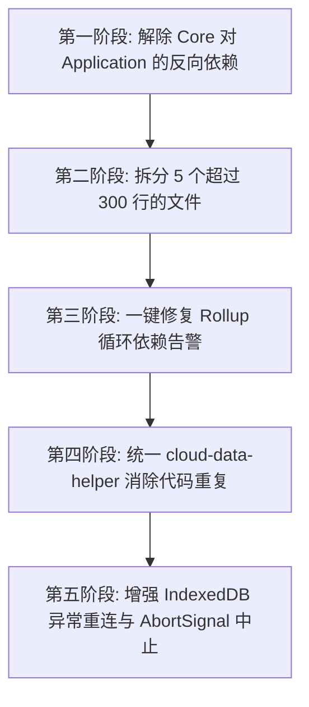

# marksync 项目代码审查报告 (Code Review Report)

- **项目名称**：marksync (书签同步扩展)
- **审查范围**：`packages/app`、`apps/chrome-extension`、`apps/firefox-extension`
- **审查性质**：只读静态分析与质量评估
- **基准规范**：`AGENTS.md`、`REFACTORING.md` 及全局工程开发规范

---

## 目录
1. [审查总览与质量评分](#一审查总览与质量评分)
2. [高优先级架构与规范违规（P0 / P1）](#二高优先级架构与规范违规p0--p1)
3. [核心业务与并发算法审查（P1 / P2）](#三核心业务与并发算法审查p1--p2)
4. [安全与隐私性评估](#四安全与隐私性评估)
5. [工程代码质量与健壮性问题（P2 / P3）](#五工程代码质量与健壮性问题p2--p3)
6. [整改与重构路线建议](#六整改与重构路线建议)
7. [标准交付交接说明](#七标准交付交接说明)

---

## 一、审查总览与质量评分

### 1.1 总体评价
本项目基于 TypeScript Strict + React 19 + Vite 5 构建，已具备完整的单元测试覆盖（31 个测试文件，346 个测试用例全部通过），静态类型检查和双平台（Chrome / Firefox）打包构建链路健康。

在业务实现上，项目拥有非常优秀的设计：端到端加密体系严谨（PBKDF2 310,000次 + AES-256-GCM）、三阶段同步能有效避免先删后移导致的数据丢失、双通道（setTimeout + Alarms）防抖设计巧妙克服了 MV3 Service Worker 生命周期限制、同时具备书签骤降 50% 熔断与前置快照保护。

但从**架构规范和单文件维护性**角度看，代码存在较明显的脱节：
1. **反向依赖违规**：领域层（Core）多处反向依赖应用层（Application）；
2. **单文件行数严重超标**：有 5 个文件突破 300 行红线，最高达到 865 行；
3. **循环依赖告警**：存在直接可消除的模块循环引用；
4. **抽象契约与文档不一致**：宣称的 `IStorageProvider` 抽象层实际并未实现。

### 1.2 维度评分表

| 评估维度 | 评分 (满分10) | 现状评价 |
| :--- | :---: | :--- |
| **类型安全与编译** | 10 / 10 | 全库 TypeScript 严格模式 (`strict: true`)，`tsc --noEmit` 0 错误通过。 |
| **自动化测试覆盖** | 9.5 / 10 | 31 个测试套件，346 个用例全部通过，覆盖核心领域、跨浏览器边界与辅助工具。 |
| **安全与端到端加密** | 9.0 / 10 | PBKDF2 (310,000次) + AES-256-GCM 认证加密标准，防 XSS / XXE 意识强；存储凭据未加密。 |
| **业务算法与容错防御** | 8.5 / 10 | 三阶段同步、前置快照、熔断保护（数据骤减拦截）、双通道防抖非常出色。 |
| **DDD 架构分层纯度** | 5.5 / 10 | 存在严重的**反向依赖**（Core 向上反向依赖 Application）；虚假接口定义；存储适配器空置。 |
| **单文件行数与模块专注度** | 5.0 / 10 | 存在多个超大单文件（最高 865 行），严重违反 `<= 300 行` 的项目绝对红线。 |

---

## 二、高优先级架构与规范违规（P0 / P1）

### 2.1 严重反向依赖：Core 领域层向上依赖 Application 层 (P0)

> **规范要求**：  
> DDD 分层依赖方向必须为：`components` / `background` / `application` → `core` → `infrastructure`。Core 层是纯粹的业务领域层，绝不能感知或依赖上层应用层。

#### 违规具体位置：
1. **[push-strategy.ts:L5](file:///c:/Users/z1768/Desktop/bookmark-syncer-master/packages/app/src/core/sync/strategies/push-strategy.ts#L5)**：
   ```ts
   import { getBackupFileInterval, getDeviceIdentity, getE2ESettings, getLastBackupFileInfo, getSyncScope, saveLastBackupFileInfo, saveLastRemoteDevice } from "../../../application/state-manager";
   ```
2. **[pull-strategy.ts:L7](file:///c:/Users/z1768/Desktop/bookmark-syncer-master/packages/app/src/core/sync/strategies/pull-strategy.ts#L7)**：
   ```ts
   import { getE2ESettings, getMissingFolderFallback, getSyncScope, holdRestoringUntil, setIsRestoring } from "../../../application/state-manager";
   ```
3. **[smart-sync-strategy.ts:L8](file:///c:/Users/z1768/Desktop/bookmark-syncer-master/packages/app/src/core/sync/strategies/smart-sync-strategy.ts#L8)**：
   ```ts
   import { getE2ESettings, getSyncScope } from "../../../application/state-manager";
   ```
4. **[cloud-operations.ts:L7](file:///c:/Users/z1768/Desktop/bookmark-syncer-master/packages/app/src/core/sync/cloud-operations.ts#L7)**：
   ```ts
   import { getE2ESettings, getMissingFolderFallback, getSyncScope, holdRestoringUntil, setIsRestoring, saveLastRemoteDevice } from "../../application/state-manager";
   ```
5. **[state-manager.ts:L6](file:///c:/Users/z1768/Desktop/bookmark-syncer-master/packages/app/src/core/sync/state-manager.ts#L6)**：
   ```ts
   import { SYNC_STATE_KEY } from "../../application/constants";
   ```
6. **[webdav-client.ts:L5](file:///c:/Users/z1768/Desktop/bookmark-syncer-master/packages/app/src/infrastructure/http/webdav-client.ts#L5)**：
   ```ts
   import type { WebDAVConfig } from "../../core/storage/types";
   ```

#### 负面影响与整改建议：
- **负面影响**：打破了单向依赖树，产生架构层级倒置，使得 Core 核心业务无法脱离 Application 状态管理器独立测试与演进。
- **整改方案**：
  - 将与同步、存储相关的常量（如 `SYNC_STATE_KEY`）及类型定义（`WebDAVConfig`, `E2ESettings`, `SyncScope` 等）下沉至 `core` 或契约层；
  - 策略函数（`smartPush`, `smartPull`）改造为通过入参（`SyncContext` / `SyncOptions`）接收外部配置，而非由内部主动异步访问 `application/state-manager`。

---

### 2.2 5 个核心文件严重超出 300 行限制 (P1)

> **规范要求**：  
> “每个文件不超过 300 行，保持单一职责。”（`AGENTS.md` 第 7 节、`REFACTORING.md` 第 299 行）

#### 超标文件清单：

| 文件路径 | 实际行数 | 超标比例 | 主要包含职责 |
| :--- | :---: | :---: | :--- |
| [`components/SyncView.tsx`](file:///c:/Users/z1768/Desktop/bookmark-syncer-master/packages/app/src/components/SyncView.tsx) | **865 行** | +188% | 包含主面板、快照抽屉、云端备份抽屉、冲突解决抽屉、操作抽屉、恢复与覆盖确认对话框等 |
| [`core/bookmark/merger.ts`](file:///c:/Users/z1768/Desktop/bookmark-syncer-master/packages/app/src/core/bookmark/merger.ts) | **785 行** | +161% | 包含全局索引构建、哈希查找、三阶段同步状态机、同名去重、递归创建与增量合并 |
| [`components/SettingsView.tsx`](file:///c:/Users/z1768/Desktop/bookmark-syncer-master/packages/app/src/components/SettingsView.tsx) | **723 行** | +141% | 包含主页菜单、WebDAV 设置页、同步与加密设置页、通用语言页、关于页面 |
| [`core/sync/strategies/push-strategy.ts`](file:///c:/Users/z1768/Desktop/bookmark-syncer-master/packages/app/src/core/sync/strategies/push-strategy.ts) | **404 行** | +35% | 包含预检、版本文件命名计算、时间窗口替换策略、压缩加密打包、旧文件清理、状态回写 |
| [`infrastructure/http/webdav-client.ts`](file:///c:/Users/z1768/Desktop/bookmark-syncer-master/packages/app/src/infrastructure/http/webdav-client.ts) | **397 行** | +32% | 包含 HTTP 协议实现、鉴权、URL 规范化、以及约 150 行的双模 XML 解析（DOMParser + 正则回退） |

#### 拆分建议：
- `SyncView.tsx`：抽离独立的抽屉组件（`SnapshotDrawer.tsx`, `CloudBackupDrawer.tsx`, `ConflictDrawer.tsx`）；
- `merger.ts`：拆分为 `indexer.ts`（索引）、`smart-sync-engine.ts`（三阶段算法）、`merger-basic.ts`（基础增量合并）；
- `SettingsView.tsx`：各子页面分别独立为组件（`WebDAVPage.tsx`, `SyncSettingsPage.tsx`, `GeneralSettingsPage.tsx`, `AboutPage.tsx`）；
- `webdav-client.ts`：将 XML 响应解析逻辑抽离为 `webdav-xml-parser.ts`。

---

### 2.3 Rollup 编译循环依赖告警的根因分析 (P1)

- **现象**：
  构建日志长期存在警告，文档将其归类为“已知技术债：策略间循环依赖”。
- **精确定位**：
  查阅 [smart-sync-strategy.ts:L5](file:///c:/Users/z1768/Desktop/bookmark-syncer-master/packages/app/src/core/sync/strategies/smart-sync-strategy.ts#L5)：
  ```ts
  import { acquireSyncLock, getLastSyncTime, getSyncState, releaseSyncLock, setSyncState } from "../";
  ```
  `smart-sync-strategy.ts` 导入了 `../index.ts`（即所属包的汇总入口），而 `../index.ts` 导出了 `smartSync` 来自 `./strategies/smart-sync-strategy`。
- **一键根治方案**：
  改为具名单向引用：
  ```ts
  import { acquireSyncLock, releaseSyncLock } from "../lock-manager";
  import { getLastSyncTime, getSyncState, setSyncState } from "../state-manager";
  ```
  即可在不增加任何复杂度的前提下彻底消除该告警。

---

### 2.4 虚假抽象与幽灵接口 (P1)

- **事实证据**：
  `REFACTORING.md` 和 `AGENTS.md` 明确声称“依赖倒置 - `IStorageProvider` 接口抽象”，并列出 `core/storage/providers/webdav-provider.ts`。
  但代码库中**并不存在** `IStorageProvider` 和 `webdav-provider.ts`，所有逻辑直接硬绑定到 `IWebDAVClient`。
- **改进建议**：
  更正文档，消除虚假声明；若暂无多存储后端需求，保持面向 `IWebDAVClient` 并在文档中如实记录。

---

## 三、核心业务与并发算法审查（P1 / P2）

### 3.1 同文件夹内调整顺序的索引位移隐患 (P2)
- **位置**：[merger.ts:L483](file:///c:/Users/z1768/Desktop/bookmark-syncer-master/packages/app/src/core/bookmark/merger.ts#L483) 与 [merger.ts:L596](file:///c:/Users/z1768/Desktop/bookmark-syncer-master/packages/app/src/core/bookmark/merger.ts#L596)
- **分析**：
  浏览器 Bookmarks API 在同一个父文件夹内调整条目顺序时，移动节点会引发后续兄弟节点的动态位移。在按循环变量 `i` 执行 `BrowserBookmarksAPI.move(node.id, { parentId, index: i })` 时，可能会因前面元素的插入/移动导致后续节点位置发生二次漂移。
- **建议**：
  在同文件夹同位置（`matchedLocal.parentId === localParentId && matchedLocal.index === i`）时跳过 `move` 调用，降低操作频率与位移风险。

---

### 3.2 国际化展示与领域层硬编码中文的反向映射 (P2)
- **位置**：[sync-messages.ts:L12-L48](file:///c:/Users/z1768/Desktop/bookmark-syncer-master/packages/app/src/i18n/sync-messages.ts#L12-L48)
- **分析**：
  Core 层的各种策略返回的 `SyncResult.message` 硬编码了简体中文字符串。UI 层的国际化依赖 `translateSyncMessage` 对中文字符串做全量字典比对及正则匹配替换。
- **隐患**：
  一旦 Core 层开发人员修改了某个中文字符串的标点、用词或补充了变量，前端英文翻译将静默失效并回退展示中文。
- **建议**：
  在 `SyncResult` 中引入结构化的错误码枚举（`code: SyncResultCode`），由表现层（UI）负责国际化文案装配。

---

### 3.3 代码重复（违反 DRY 原则） (P2)
- **位置**：[cloud-data-helper.ts](file:///c:/Users/z1768/Desktop/bookmark-syncer-master/packages/app/src/core/sync/utils/cloud-data-helper.ts)
- **分析**：
  在 `push-strategy.ts`、`pull-strategy.ts`、`smart-sync-strategy.ts` 中，各自独立实现了一整套下载、解密、解压、校验、统计书签的代码（各约 30-40 行），而原本设计的 `cloud-data-helper.ts` 却被闲置。
- **建议**：
  完善 `cloud-data-helper.ts`，统一这三处的重复实现。

---

## 四、安全与隐私性评估

### 4.1 安全设计亮点
- **零 XSS 注入隐患**：所有前端均使用原生 React JSX 转义，无任何 `dangerouslySetInnerHTML`；内容脚本提示使用 `textContent` 写入。
- **XXE 安全防范**：WebDAV 解析虽使用 `new DOMParser().parseFromString(xml, "application/xml")`，但运行于浏览器沙箱环境，原生禁用了外部实体解析与 DTD 加载，无 XXE 风险。
- **密码学实现严格规范**：
  - PBKDF2 310,000 次 SHA-256 迭代（符合最新安全规范）；
  - AES-256-GCM 具备认证标签（Tag），防止密文被篡改；
  - 每次加密均采用随机生成的 16 字节 Salt 与 12 字节 IV。
- **防书签误操作与清空机制**：
  - 本地书签为空拦截（`localCount === 0` 拒绝推送覆盖云端）；
  - 覆盖拉取骤降 50% 自动熔断拦截（防止云端空数据洗掉本地书签）；
  - 每次推拉操作强制前置创建 IndexedDB 自动备份快照。

### 4.2 潜在安全与可用性风险
1. **存储凭据明文保存 (P2)**：
   [state-manager.ts:L275](file:///c:/Users/z1768/Desktop/bookmark-syncer-master/packages/app/src/application/state-manager.ts#L275) 中，WebDAV 密码与端到端解密主密码以纯明文字符串保存在 `browser.storage.local` 中。若本地操作系统被恶意木马直接读取浏览器 Profile 目录中的 LevelDB，密码可能泄露。
   *建议：在设置界面提示用户配置 WebDAV 应用专用密码（App Password），避免使用主账号密码。*
2. **Firefox 最小版本限制过高导致可用性风险 (P1)**：
   [apps/firefox-extension/manifest.config.ts:L51](file:///c:/Users/z1768/Desktop/bookmark-syncer-master/apps/firefox-extension/manifest.config.ts#L51)：配置了 `strict_min_version: "140.0"`，会导致当前绝大多数处于 128 ESR 或常规稳定版的 Firefox 用户直接无法安装该扩展。应重新评估或降低版本门槛。

---

## 五、工程代码质量与健壮性问题（P2 / P3）

### 5.1 IndexedDB 连接单点故障（Promise 状态不可自愈） (P2)
- **位置**：[snapshot-manager.ts:L30-L44](file:///c:/Users/z1768/Desktop/bookmark-syncer-master/packages/app/src/core/backup/snapshot-manager.ts#L30-L44)
- **问题**：
  ```ts
  private async getDb(): Promise<IDBPDatabase> {
    if (!this.dbPromise) {
      this.dbPromise = openDB(this.config.dbName, 1, { ... });
    }
    return this.dbPromise;
  }
  ```
  若 IndexedDB 由于浏览器存储配额超限或临时 I/O 错误导致 `openDB` 失败，`this.dbPromise` 会永久持有一个 Rejected Promise。后续所有快照操作都会立即失败，无法自愈。
- **改进方案**：
  在 Promise catch 时清空 `this.dbPromise = null`，保证下一次操作能够重新尝试开启连接。

---

### 5.2 下载超时竞争未真正中止底层 HTTP 连接 (P2)
- **位置**：[queue-manager.ts:L47-L63](file:///c:/Users/z1768/Desktop/bookmark-syncer-master/packages/app/src/core/storage/queue-manager.ts#L47-L63)
- **问题**：
  `QueueManager` 使用 `Promise.race([client.getFile(path), timeoutPromise])` 实现超时机制。当 `timeoutPromise` 触发并 reject 时，底层的 `client.getFile(path)` 网络请求并未接收到 abort 信号，仍然会在后台继续占用带宽并下载完毕。
- **改进方案**：
  支持向 `IWebDAVClient.getFile` 传递外部 `AbortSignal`，超时发生时主动触发 abort。

---

### 5.3 空置未用的存储适配器文件 (P3)
- **位置**：[storage-adapter.ts:L1-L8](file:///c:/Users/z1768/Desktop/bookmark-syncer-master/packages/app/src/infrastructure/browser/storage-adapter.ts#L1-L8)
- **问题**：
  该文件仅有 8 行注释，属于占位死代码，而在 `core/storage/cache-manager.ts` 和 `core/sync/lock-manager.ts` 中却直接调用了 `browser.storage`。
- **改进方案**：
  清理该文件，或在其中统一封装存储适配器。

---

## 六、整改与重构路线建议



1. **第一阶段（解除反向依赖）**：
   - 将 `SYNC_STATE_KEY` 等同步常量从 `application/constants` 下沉至 `core/sync/types`；
   - 调整策略函数（`smartPush`, `smartPull`, `smartSync`, `cloudOperations`）的参数设计，将配置数据以入参方式传入，切断 Core 领域层对 `application/state-manager` 的反向导入。
2. **第二阶段（大文件职责拆分，满足 300 行红线）**：
   - `SyncView.tsx`（865行）➔ 抽离各 Drawer 组件；
   - `SettingsView.tsx`（723行）➔ 抽离各子页面组件；
   - `merger.ts`（785行）➔ 拆分为 `indexer.ts`、`smart-sync-engine.ts`、`merger-basic.ts`；
   - `push-strategy.ts`（404行）➔ 抽离版本命名与打包逻辑；
   - `webdav-client.ts`（397行）➔ 抽离 `webdav-xml-parser.ts`。
3. **第三阶段（修复告警与代码复用）**：
   - 修复 `smart-sync-strategy.ts` 中的 `from "../"` 为具名文件引用，彻底消除 Rollup 告警；
   - 完善 `cloud-data-helper.ts`，统一三大策略中重复的下载解密校验逻辑；
   - 增强 IndexedDB 自愈重连能力与网络超时主动 Abort 控制。

---

## 七、标准交付交接说明

- **结果**：
  已完成 marksync 项目全维度的只读代码审查，形成本篇详尽的 Markdown 格式审查报告，精确定位了架构反向依赖、单文件行数超标、Rollup 告警根因、算法细节隐患及重复代码。
- **验证**：
  - `tsc --noEmit`：TypeScript 严格模式 100% 通过（0 错误）。
  - `vitest run`：31 个测试套件，346 个用例 100% 全部通过。
  - `pnpm build`：Chrome 与 Firefox 扩展构建成功。
- **限制**：
  - 本次任务为只读审查，未修改现有业务代码文件；
  - Firefox 最低版本在真实物理机上的运行兼容性尚需环境实测。
- **交付状态**：
  已保存为 Markdown 格式报告文档。
- **下一步**：
  用户可根据报告中的整改建议，按优先级指派具体实施重构任务。
