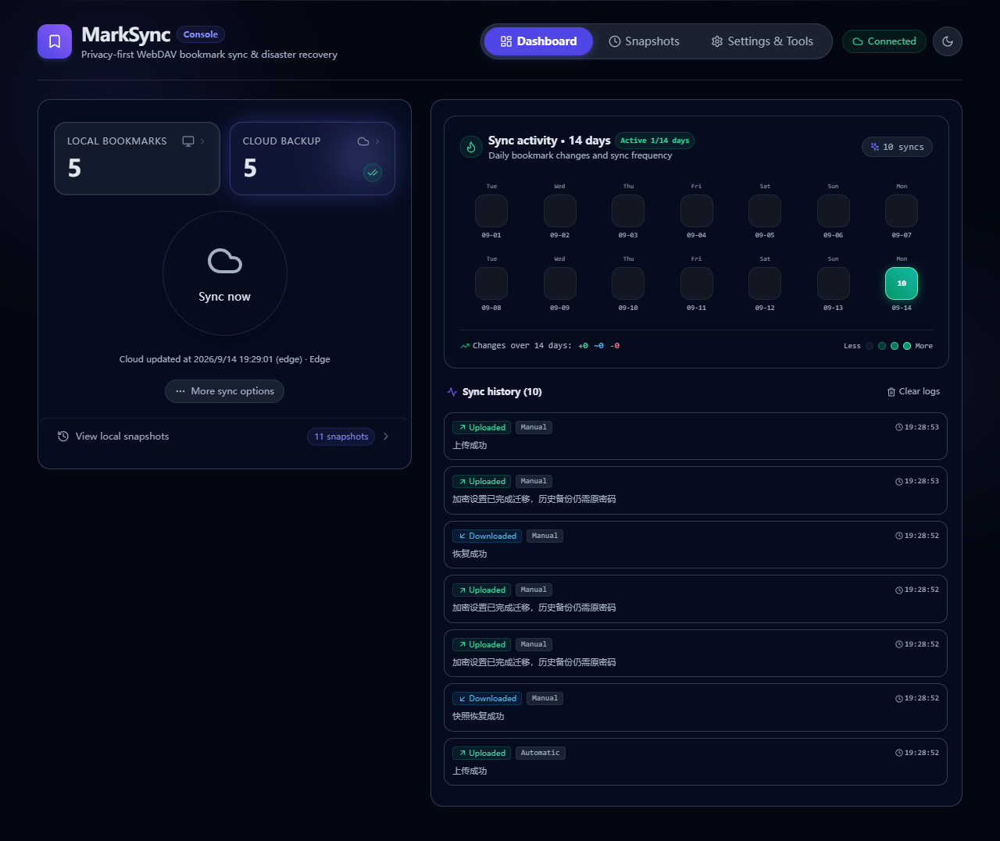

# MarkSync 真实扩展集成验收记录

> 后续更新：已补充无调试器 Edge 重启补传与成功上传后持久化的 2 项检查，见 [后台生命周期验收记录](LIFECYCLE_VALIDATION_2026-09-14.md)。下文保留本阶段历史结果和当时的未执行项。

> 日期：2026-09-14｜版本：1.5.2｜状态：**隔离 Edge 集成验收通过，仍为待发布验收候选版。**
> 前序：[集中修复结果](FIX_RESULTS_2026-09-14.md)。本文记录用户要求“下一步”后新增的验证和修复，不改写上轮历史证据。

## 1. 本轮结果

已在两个独立临时 Edge profile 中加载实际 Chrome 构建，运行真实扩展 Service Worker、书签 API、storage、alarms 与 IndexedDB。通过本机 HTTP WebDAV 测试服务验证跨 profile 同步；此次没有替换扩展内部 API 或 provider 实现。

最终 **9 项集成场景全部通过**，同时修复了实机发现的两处问题。新增回归后，全量单元测试 **46 文件、463 用例通过**；Chrome/Firefox strict 类型检查和构建通过。

没有读写个人浏览器书签、真实云端账号或生产数据；没有提交、推送、签名或发布。

## 2. 实机发现并修复的问题

### I01：范围字段顺序导致有效同步基线失效

- **表现**：B 设备完成拉取、随后确认内容一致，A 删除书签并上传后，B 再次同步仍要求选择方向，不能自动传播删除。
- **原因**：`SyncStateManager.getState` 使用 `JSON.stringify(scope)` 比较。Chrome storage 持久化可能重排对象属性；字段值相同、顺序不同就被判为基线失效。原内存 mock 保留插入顺序，未暴露该差异。
- **修复**：使用 `SYNC_SCOPE_KEYS` 逐项比较布尔值，保留缺失范围或真正改变范围时的失效逻辑。
- **验证**：新增“浏览器重排属性后仍识别同一范围”的回归；实际双 profile 删除传播由失败变为通过。
- **维护源**：[state-manager.ts](../packages/app/src/core/sync/state-manager.ts)，测试位于对应镜像目录。

### I02：手动操作被标记为自动，日志正文丢失实际结果

- **表现**：真实界面中手动上传、恢复和加密迁移被记录为 Automatic，部分结果只显示统一的“上传/下载成功”。
- **原因**：后台消息处理调用通知函数时未提供 `trigger` 和 `message`，落入默认自动来源及通用文案。
- **修复**：页面请求完成后明确记录 `manual` 和该操作实际返回的结果消息。
- **验证**：新增消息处理器回归；最终真实扩展界面可见 Manual 与对应迁移/恢复结果。
- **维护源**：[op-handler.ts](../packages/app/src/background/op-handler.ts)，测试位于对应镜像目录。

## 3. 集成场景

最终运行：2026-09-14 19:28（北京时间），Edge **153.0.4234.32**。

| 场景 | 实际断言 | 结果 |
| --- | --- | --- |
| 两个 profile 首次同步与范围保护 | B 首次内容不同先选择方向；覆盖后得到 A 的书签栏；Other 中同 URL 书签的原 ID 保留 | 通过 |
| 内容一致基线及删除传播 | 重复同步保留 localHash；A 删除后 B 自动拉取删除；范围外节点仍保留 | 通过 |
| 本地未上传编辑 | B 改名后 A 有新版本，B 要求方向选择且保留未上传改名 | 通过 |
| 云端 503 | 预检失败返回错误，服务端未收到任何额外 PUT | 通过 |
| 失败事件可靠补传 | 编辑失败后 pending 未被 ACK；服务恢复后等待真实约 45 秒 alarm，无需再次编辑即完成并 ACK | 通过 |
| 真实快照清空与恢复 | 安全快照进入 IndexedDB；清空本地后以返回的快照 ID 恢复；书签栏及 Other 的合成内容恢复 | 通过 |
| 加密生命周期 | 启用、改密、用旧密码恢复历史备份、关闭；旧文件保留，全局新密码不被历史恢复改回，迁移记录最终清除 | 通过 |
| 关闭发起页面与共享锁 | PUT 暂停时另一页面请求被锁拒绝；关闭发送页后释放服务端响应，后台仍完成上传和基线提交 | 通过 |
| SW 停止与消息唤醒 | CDP 停止 Service Worker，随后实际 runtime 消息重新唤醒并完成连接测试 | 通过 |

最终服务端观测到 62 次 PROPFIND、8 次 PUT、22 次 GET 和 4 次 DELETE，均针对内存中的合成文件。失败信息、请求计数和场景名见 [results.json](validation/2026-09-14-extension/results.json)。



历史日志正文仍保留操作返回的原语言；英文 UI 标签与 Manual/Automatic 来源已正确显示。本文不将日志正文全部本地化列为已完成项。

## 4. 可复现入口与质量检查

脚本：[scripts/verify-extension.cjs](../scripts/verify-extension.cjs)。该脚本只监听 `127.0.0.1`，使用 `mkdtemp` 创建 profile，不接触默认浏览器 profile；结束后关闭测试浏览器和服务，临时 profile 留在系统临时目录。

```powershell
# 仓库根目录；使用本机已有 Playwright，无需新增项目依赖
$env:MARKSYNC_PLAYWRIGHT = '<已安装的 playwright 模块绝对路径>'
node scripts/verify-extension.cjs

# packages/app
node node_modules/vitest/vitest.mjs run --reporter=dot

# 分别在 apps/chrome-extension 与 apps/firefox-extension
node node_modules/typescript/bin/tsc --noEmit
node node_modules/vite/bin/vite.js build
```

| 检查 | 结果 |
| --- | --- |
| 最终实际扩展集成脚本 | 9 项通过，failure=null |
| 全量 Vitest，19:27 | 46 文件、463 用例通过 |
| Chrome 与 Firefox 类型检查、构建 | 两平台均通过，dist 由构建生成 |
| `git diff --check`、维护源行数 | 通过，无 TS/TSX 维护源超过 300 行；集成脚本也少于 300 行 |
| 包体及依赖提示 | 仍有 500 kB chunk 提示（主包约 582.38 kB）和过期 Browserslist 数据提示；未隐藏或调整阈值 |
| 版本、依赖、发布链路 | 未修改 |

最终源码/测试及产物摘要见 [build-evidence.json](validation/2026-09-14-extension/build-evidence.json)。此前 461/462 用例的结果不代替本轮最终 463 用例结果。

## 5. 仍未完成的发布验收

1. **真实 WebDAV/GitHub Gist 服务**：本机服务是受控协议夹具，不能证明真实权限、限流、代理、服务端竞争与 Gist PATCH 语义。下一阶段需要专用测试目标及账号；不使用个人备份库代替。
2. **无调试器的扩展生命周期**：Playwright/CDP 可能影响 SW 保活。本轮关闭的是扩展页面，并非工具栏原生 popup；不能推断自然休眠、强制中断恢复写入或改密各阶段均已通过。
3. **Firefox 与移动端实机**：完成 Firefox 构建，但没有将其加载到真实 Firefox 验收，也没有移动端结果。
4. **真实浏览器缩放与无障碍**：前序 CSS zoom/键盘页面证据可复用，屏幕阅读器和真实 125%/150% 浏览器缩放仍未完成。
5. **双物理设备与大型数据**：两个同机 profile 验证内容及隔离逻辑，不代表跨设备网络、系统时钟、原生书签同步竞争或超大数据集性能。

以上未执行项不能写成通过。此阶段不升级为“可直接发布”。

## 6. 交接

- **结果**：完成隔离真实扩展验收，修复范围基线比较及手动日志来源；新增可重复运行的验收脚本。
- **验证**：最终 9 项集成、463 用例、两平台类型检查和构建通过。
- **限制**：真实服务商、Firefox/移动端及无调试器生命周期仍需专用环境。
- **交付状态**：源码、测试、脚本、文档及证据已保存；未提交、未推送、未发布。已有工作成果保留。
- **下一步**：准备专用 WebDAV/Gist 测试目标和隔离 Firefox 环境，再执行第 5 节场景；实际账号/外部写入与发布仍按授权边界处理。
